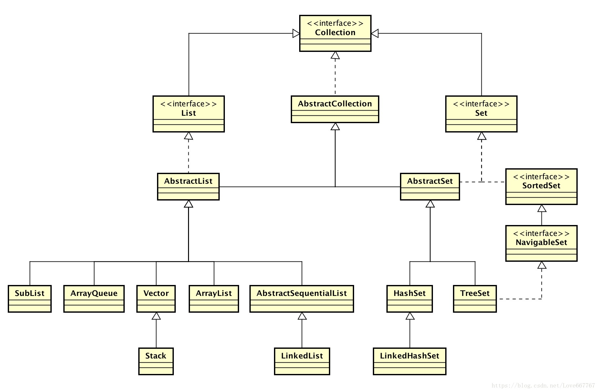
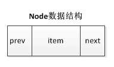

## 目录

1. 概述
2. 类图
3. 源码：List（增、删、改、查）
	1. 初始化
	2. 增
	3. 删
	4. 改
	5. 查
	6. 其它
4. 源码：Deque（入队、出队、获取队头元素）
	1. 入队
	2. 出队
	3. 获取队头元素
5. 源码：Deque（进栈、出栈）
	1. 进栈
	2. 出栈
6. 小结


---

## 一、概述
LinkedList 是一个双链表结构，实现了 List、Deque接口，因此具备了 List 的操作特性，和队列的特性。

**版本：** `JDK 1.8`

**参考：**
[数据结构(Queue) — Queue 综述](https://blog.csdn.net/love667767/article/details/80524813)

---

## 二、类图



---

## 三、源码：List（增、删、改、查）

```java
public class LinkedList<E> extends AbstractSequentialList<E>
    implements List<E>, Deque<E>, Cloneable, java.io.Serializable {
    // ...
}

// List接口
public interface List {}
// 队列接口
public interface Deque {}

// 标记接口：接口内没有任何方法
public interface Cloneable {}
public interface Serializable {}
```

>通过类的声明，我们知道 LinkedList 实现了 `List` 和 `Deque` 两个接口，这说明 LinkedList 具备了 List 和 Deque 的特点，下面我们就从这两个方面来分别分析 LinkedList 的源码。

### 3.1 初始化

```java
transient int size = 0;  //当前链表集合大小
transient Node<E> first; //链表头部指针
transient Node<E> last;  //链表尾部指针

public LinkedList() {}

public LinkedList(Collection<? extends E> c) {
    this();
    addAll(c);
}

/*
 * Node节点是链表的基本数据结构(由3部分组成)
 */
private static class Node<E> {
    E item;       //该元素的值
    Node<E> next; //该元素后面一个元素的引用地址
    Node<E> prev; //该元素前面一个元素的引用地址

    Node(Node<E> prev, E element, Node<E> next) {
        this.item = element;
        this.next = next;
        this.prev = prev;
    }
}
```



### 3.2  增

>添加元素的4种方法：
>
>1. `public boolean add(E e) {}`
>2. `public void add(int index, E element) {}`
>3. `public boolean addAll(Collection< ? extends E> c) {}`
>4. `public boolean addAll(int index, Collection< ? extends E> c) {}`

`public boolean add(E e) {}`

```java
//将元素添加到链表尾部
public boolean add(E e) {
    linkLast(e);
    return true;
}

/**
 * 将元素e添加到链表的尾部
 * Links e as last element.
 */
void linkLast(E e) { 
    final Node<E> l = last; //1.将链表尾部节点节点暂存;
    final Node<E> newNode = new Node<>(l, e, null);//2.将尾部节点添加到新节点的prev中;
    last = newNode;//3.将尾部节点指针指向新的节点
    if (l == null)//4.若链表为空，则需要将头部节点的指针指向当前新添加的结点;
        first = newNode;
    else //5.若链表不为空，则将新节点添加到原尾节点的next;
        l.next = newNode;
    size++; //更新链表大小
    modCount++;//修改modCount(凡涉及到修改链表的操作，都会自增modCount来表示操作)
}
```

`public void add(int index, E element) {}`

```java
//将元素添加到指定位置
public void add(int index, E element) {
    checkPositionIndex(index);
    
    //插入到队列末端;
    if (index == size)
        linkLast(element);
    else //插入到指定位置
        linkBefore(element, node(index));
}

/**
 * 插入元素到指定的位置，原先位置的元素向后移动一位;
 * Inserts element e before non-null Node succ.
 */
void linkBefore(E e, Node<E> succ) {
    //存储succ节点的prev;
    final Node<E> pred = succ.prev;
    //创建一个新节点，并关联前后两个节点;
    final Node<E> newNode = new Node<>(pred, e, succ);
    //将新节点赋值给下一个节点的prev
    succ.prev = newNode;
    if (pred == null)//插入到链表头的位置;
        first = newNode;
    else//插入到非链表头的位置;
        pred.next = newNode;
    size++;//修改链表大小
    modCount++;//修改modCount
}
```

关于添加一个集合，跟前面添加一个元素类似，不同点在于个数从1个变成集合的长度；
`public boolean addAll(Collection< ? extends E> c) {}`
`public boolean addAll(int index, Collection< ? extends E> c) {}`

<br>

### 3.3 删

>删除元素的2种方法：
>
>1. `public E remove(int index) {}`
>2. `public boolean remove(Object o) {}`

`public E remove(int index) {}`

```java
/**
 * Removes the element at the specified position in this list.
 */
public E remove(int index) {
    checkElementIndex(index);
    //从链表中删除节点
    return unlink(node(index));
}

//从链表中删除节点
E unlink(Node<E> x) {
	final E element = x.item; //当前节点的元素值
	final Node<E> next = x.next; //当前节点的后置节点
	final Node<E> prev = x.prev;//当前节点的前置节点
	
	// 删除链表头节点
	if (prev == null) {
	    first = next;  //移动first指针指向下一个节点
	} else { //删除链表非头部节点
	    prev.next = next;
	    x.prev = null;
	}
	
	// 删除链表尾部节点
	if (next == null) {
	    last = prev; //移动last指针指向上一个节点
	} else { //删除链表非尾部节点
	    next.prev = prev;
	    x.next = null;
	}
	
	x.item = null; //将当前元素值置空,利于垃圾回收，否则仍有元素被节点的item依赖;
	size--;
	modCount++;
	return element; //返回删除的元素
}
```

`public boolean remove(Object o) {}`

```java
/**
 * Removes the first occurrence of the specified element from this list, if it is present. 
 * 每次删除都会从链表头开始遍历，效率较低;
 */ 
public boolean remove(Object o) {
    if (o == null) {
        for (Node<E> x = first; x != null; x = x.next) {
            if (x.item == null) {
                unlink(x); //移除链表中为null的节点
                return true;
            }
        }
    } else {
        for (Node<E> x = first; x != null; x = x.next) {
            if (o.equals(x.item)) {
                unlink(x); //移除链表中非null的节点
                return true;
            }
        }
    }
    return false;
}
```

### 3.4 改
>修改元素的 1 种方法：
>
>1. `public E set(int index, E element) {}`

`public E set(int index, E element) {}`

```java
/**
 * Replaces the element at the specified position in this list with the specified element.
 */
public E set(int index, E element) {
    checkElementIndex(index);
    Node<E> x = node(index); //1.找到指定节点的元素;
    E oldVal = x.item;    
    x.item = element; //2.将新的值赋值给节点的item
    return oldVal;
}

/**
 * Returns the (non-null) Node at the specified element index.
 * 找到指定位置的节点
 */
Node<E> node(int index) {
    // assert isElementIndex(index);
	// 这里做了一次二分法查询，提升了查询效率;
    if (index < (size >> 1)) {
        Node<E> x = first;
        for (int i = 0; i < index; i++)
            x = x.next;
        return x;
    } else {
        Node<E> x = last;
        for (int i = size - 1; i > index; i--)
            x = x.prev;
        return x;
    }
}
```

### 3.5 查
>查询元素的 1 种方法：
>
>1. `public E get(int index) {}`

`public E get(int index) {}`

```java
    /**
     * Returns the element at the specified position in this list.
     */
    public E get(int index) {
        checkElementIndex(index);
        return node(index).item; //node(index)为回去指定位置的元素;
    }
```

### 3.6 其它

`public Object[] toArray() {}`

```java
/**
 * 将链表结构的数据转换成数组
 * Returns an array containing all of the elements in this list
 * in proper sequence (from first to last element).
 */
public Object[] toArray() {
    Object[] result = new Object[size];
    int i = 0;
    for (Node<E> x = first; x != null; x = x.next)
        result[i++] = x.item;
    return result;
}
```

<br>

## 四、源码：Deque（入队、出队、获取队头元素）

### 4.1 入队
>入队有 6 种方法：
>
>1. 继承自Queue接口
>
>    `boolean add(E e) {}`   //同 addLast(E e)
> 
>    `boolean offer(E e) {}`  //同 offerLast(E e)
>2. 继承自Deque：添加元素，如果添加不成功，会抛出IllegalStateException异常;
>
>    `void addFirst(E e) {}` //添加到队头;
> 
>    `void addLast(E e) {}`//添加到队尾;
>3. 继承自Deque：添加元素，不抛异常;
>
>    `boolean offerFirst(E e) {}`//添加到队头;
> 
>    `boolean offerLast(E e) {}` //添加到队尾;

`public boolean add(E e) {}`
`public boolean offer(E e) {}`

```java
// 将元素添加到链表尾部
public boolean add(E e) {
    linkLast(e);
    return true;
}
// 将元素添加到链表尾部
public boolean offer(E e) {
    return add(e);
}
```

`public void addFirst(E e) {}`

`public boolean offerFirst(E e) {}`

`public void addLast(E e) {}`

`public boolean offerLast(E e) {}`

```java
//Inserts the specified element at the beginning of this list.
public void addFirst(E e) {
    linkFirst(e);
}

//Inserts the specified element at the front of this list.
public boolean offerFirst(E e) {
    addFirst(e);
    return true;
}

//Appends the specified element to the end of this list.
public void addLast(E e) {
    linkLast(e); //这个前面已经分析过
}

//Inserts the specified element at the end of this list.
public boolean offerLast(E e) {
    addLast(e);
    return true;
}

/**
 * Links e as first element.
 * 这个可参考linkLast(e)分析
 */
private void linkFirst(E e) {
    final Node<E> f = first;
    final Node<E> newNode = new Node<>(null, e, f);
    first = newNode;
    if (f == null)
        last = newNode;
    else
        f.prev = newNode;
    size++;
    modCount++;
}
```

### 4.2 出队
>出队有 6 种方法：
>
>1. 继承自Queue：
>
>	`E remove() {}` //同 removeFirst()
> 
>   ` E poll() {}`   //同 pollFirst()
> 
>2. 继承自Deque：移除元素,抛异常;
> 
>   `E removeFirst() {}` //从队首移除;
>   
>    `E removeLast() {}` //从队尾移除;
> 
>3. 继承自Deque：移除元素,不抛异常;
> 
>    `E pollFirst() {}` //从队首移除;
>   
>   `E pollLast() {}` //从队尾移除;


`public E remove() {}`

`E removeFirst() {}`

`public E poll() {}`

`E pollFirst() {}`

```java
//Retrieves and removes the head (first element) of this list.
public E remove() {//会抛出异常
    return removeFirst();
}

//Removes and returns the first element from this list.
public E removeFirst() {
    final Node<E> f = first;
    if (f == null)//会抛出异常
        throw new NoSuchElementException();
    return unlinkFirst(f);
}

//Retrieves and removes the head (first element) of this list.
public E poll() {
    final Node<E> f = first;
    return (f == null) ? null : unlinkFirst(f);
}

//Retrieves and removes the first element of this list, or returns {@code null} if this list is empty.
public E pollFirst() {
    final Node<E> f = first;
    return (f == null) ? null : unlinkFirst(f);
}

/**
 * Unlinks non-null first node f.
 */
private E unlinkFirst(Node<E> f) {
    // assert f == first && f != null;
    final E element = f.item;
    final Node<E> next = f.next;
    f.item = null;
    f.next = null; // help GC
    first = next;
    if (next == null)
        last = null;
    else
        next.prev = null;
    size--;
    modCount++;
    return element;
}
```

`E removeLast() {}`

`E pollLast() {}` 

```java
//Removes and returns the last element from this list.
public E removeLast() {
    final Node<E> l = last;
    if (l == null)//会抛出异常
        throw new NoSuchElementException();
    return unlinkLast(l);
}

//Retrieves and removes the last element of this list, or returns {@code null} if this list is empty.
public E pollLast() {
    final Node<E> l = last;
    return (l == null) ? null : unlinkLast(l);
}

/**
 * Unlinks non-null last node l.
 */
private E unlinkLast(Node<E> l) {
    // assert l == last && l != null;
    final E element = l.item;
    final Node<E> prev = l.prev;
    l.item = null;
    l.prev = null; // help GC
    last = prev;
    if (prev == null)
        first = null;
    else
        prev.next = null;
    size--;
    modCount++;
    return element;
}
```


### 4.3 获取队头元素
>获取元素有 6 种方法：
>
>1. 继承自Queue：
> 
>  `E element() {}`//同 getFirst()
> 
>  `E peek() {}`    //同 peekFirst()
> 
>2. 获取元素，但不移除,若为空队列时，抛出异常;
>
>  `E getFirst() {}` //获取队首元素
> 
>  `E getLast() {}`  //获取队尾元素
> 
>3. 获取元素，但不移除,若为空队列时，不抛出异常;
>
>  `E peekFirst() {}` //获取队首元素
> 
>  `E peekLast() {}` //获取队尾元素


`E element() {}`

`E peek() {}` 
 
`E getFirst() {}` 

`E peekFirst() {}` 

```java
//Retrieves, but does not remove, the head (first element) of this list.
public E element() {//会抛出异常
    return getFirst();
}

//Retrieves, but does not remove, the head (first element) of this list.
public E peek() {
    final Node<E> f = first;
    return (f == null) ? null : f.item;
}

//Returns the first element in this list.
public E getFirst() {
    final Node<E> f = first;
    if (f == null)//会抛出异常
        throw new NoSuchElementException();
    return f.item;
}

//Retrieves, but does not remove, the first element of this list, or returns {@code null} if this list is empty.
public E peekFirst() {
    final Node<E> f = first;
    return (f == null) ? null : f.item;
}
```

`E getLast() {}`
`E peekLast() {}`

```java
//Returns the last element in this list.
public E getLast() {
    final Node<E> l = last;
    if (l == null)//会抛出异常
        throw new NoSuchElementException();
    return l.item;
}

//Retrieves, but does not remove, the last element of this list, or returns {@code null} if this list is empty.
public E peekLast() {
    final Node<E> l = last;
    return (l == null) ? null : l.item;
}
```

<br>

## 五、源码：Deque（进栈、出栈）

LinkedList 实现的栈，是从链表头部进栈，从链表头部出栈；

### 5.1 进栈

`public void push(E e) {}`

```java
/**
 * Pushes an element onto the stack represented by this list.  In other
 * words, inserts the element at the front of this list.
 *
 * <p>This method is equivalent to {@link #addFirst}.
 */
public void push(E e) {
    addFirst(e);
}
```

### 5.2 出栈

`public E pop() {}`

```java
/**
 * Pops an element from the stack represented by this list.  In other
 * words, removes and returns the first element of this list.
 * 
 * <p>This method is equivalent to {@link #removeFirst()}.
 */
public E pop() {
    return removeFirst();
}
```

---


## 六、小结

**知识点：**

1. LinkedList 是双向列表，且线程不安全的集合；
2. 查询元素时，会进行一次二分法查找，提高了查询的效率；
3. 增加、删除元素时，会修改modCount值，修改、查询不会修改modCount值；因此，增删可能引起并发修改异常，改查不会；
4. LinkedList 实现了双向队列操作；
5. LinkedList 实现了栈功能 (即 **`LIFO`** 的操作)；

**链表的优点：**
链表不会一次性创建很多的内存空间，且内存空间不要求连续，所以可以在新增一个元素时再去创建内存空间。

**链表的缺点：**
由于内存不连续，所以需要额外的字段去存储前后元素的内存地址，因此对于单个元素来说，消耗的内存大小比 ArrayList 要高。