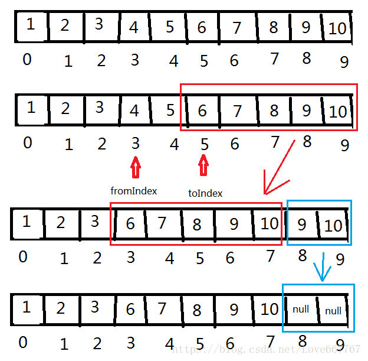

## 目录
1. 概述
2. 类图
3. 源码分析
	1. 初始化
	2. 增、删、改、查
		1. 增
		2. 删
		3. 改
		4. 查
	3. 序列化
	4. 迭代器
	5. 其他
4. 小结

## 一、概述

**版本：** `JDK 1.8`

>Java中，数组在声明时，需要确定其数组长度，所以不具备自动扩容的特点；
而 ArrayList 底层实现是数组，且具备自扩容的能力，所以可以把 ArrayList 理解为是一个 **`动态数组`**。
同时，由于数组的内存地址是连续的，所以 **`具备随机快速访问的能力`** ，通过下标查询数据的 **`时间复杂度位O(1)`**，即常数阶时间复杂度。

**问：** 为什么在创建数组的时候，就需要声明数组的长度呢？
**答：** 虚拟机要分配一段连续的内存给数组，假设长度不固定，则数组最后位置的内存地址不能确定。

>在类声明的地方，实现了很多`标记接口`，其作用只是作为一个标识符。
>**例如：** ArrayList 实现了 RandomAccess 标识接口，说明 ArrayList **`本身就具备`** 随机访问的能力，而不是实现了 RandomAccess 标识接口才具备随机访问的能力。

```java
public class ArrayList<E> extends AbstractList<E>
        implements List<E>, RandomAccess, 
        Cloneable, java.io.Serializable {
    // ...
}

// 标记接口：接口内没有任何方法
public interface RandomAccess {}
public interface Cloneable {}
public interface Serializable {}
```

---

## 二、类图


---

## 三、源码分析

**问题：**

1. ArrayList的初始容量是多少？
2. ArrayList内部实现的原理是什么？
3. 当容量不够的时候，是如何实现扩容的？
4. ArrayList的特点是什么(增删、查询) ？为什么？
5. `ConcurrentModificationException` 是如何产生的，如何避免？

带着上面几个问题，从 `初始化、增、删、改、查、序列化、迭代器` 等方面来分析源码；

### 3.1 初始化

```java
// 初始容量大小
private static final int DEFAULT_CAPACITY = 10;
private static final Object[] EMPTY_ELEMENTDATA = {};
private static final Object[] DEFAULTCAPACITY_EMPTY_ELEMENTDATA = {};
// 真正存放元素的数组容器
transient Object[] elementData; // non-private to simplify nested class access
// ArrayList 的元素个数
private int size;
```

**构造方法：**

```java
public ArrayList() {
 // 默认赋值的是一个空数组
    this.elementData = DEFAULTCAPACITY_EMPTY_ELEMENTDATA;
}

// 设置初始容量大小
public ArrayList(int initialCapacity) {
    if (initialCapacity > 0) {
     // 初化一个指定大小的Object[]
        this.elementData = new Object[initialCapacity];
    } else if (initialCapacity == 0) {
        this.elementData = EMPTY_ELEMENTDATA;
    } else {
        throw new IllegalArgumentException("Illegal Capacity: "+
                                           initialCapacity);
    }
}

/*
 * 将一个已知的集合添加到当前集合中；数组类型要保持Object[]
 */
public ArrayList(Collection<? extends E> c) {
    elementData = c.toArray();
    if ((size = elementData.length) != 0) {
	    // 判断c.toArray()返回的数组类型是否为Object[];如果不是，需要转换成Object[];
        // c.toArray might (incorrectly) not return Object[] (see 6260652)
        if (elementData.getClass() != Object[].class)
            elementData = Arrays.copyOf(elementData, size, Object[].class);
    } else {
        // replace with empty array.
        this.elementData = EMPTY_ELEMENTDATA;
    }
}
```
`public Object[] Collection.toArray()` **方法：**

>所有的 Collection 子类通过这个方法都会将自身的集合元素转化成一个数组类型，不一定是Object[]；

`Arrays.copyOf(elementData, size, Object[].class)` **方法：**

```java
// Arrays.class
public static <T,U> T[] copyOf(U[] original, int newLength, Class<? extends T[]> newType) {
	// 这里判断newType的类型是否是Object[]，如果不是，则通过反射构造出对应类型的数组;
    @SuppressWarnings("unchecked")
    T[] copy = ((Object)newType == (Object)Object[].class)
        ? (T[]) new Object[newLength]
        : (T[]) Array.newInstance(newType.getComponentType(), newLength);
    // 数组之间进行拷贝，native层拷贝，效率比for循环高;
    System.arraycopy(original, 0, copy, 0,
                     Math.min(original.length, newLength));
    return copy;
}

 /*
  * System.class
  * @param      src      the source array.
  * @param      srcPos   starting position in the source array.
  * @param      dest     the destination array.
  * @param      destPos  starting position in the destination data.
  * @param      length   the number of array elements to be copied.
  */
public static native void arraycopy(Object src,  int  srcPos,
                                        Object dest, int destPos,
                                        int length);
```

<br>

### 3.2 增、删、改、查

#### 3.2.1 增

>**添加元素的4种方法：**
>
>1. `public boolean add(E e) {}`
2. `public void add(int index, E element) {}`
3. `public boolean addAll(Collection<? extends E> c) {}`
4. `public boolean addAll(int index, Collection<? extends E> c) {}`


`public boolean add(E e) {}`

```java
/*
 * 由于内部是一个Object[]，所以新添加一个元素之前要先判断当前的数组容量是否还能支持元素的添加；
 * 1.如果不能，就先对数组进行扩容，再添加元素；
 * 2.否则，直接添加元素；
 */
public boolean add(E e) {
	// 1.判断容量是否需要扩容
	ensureCapacityInternal(size + 1);  // Increments modCount!!
	// 2.添加元素
	elementData[size++] = e;
	return true;
}

private void ensureCapacityInternal(int minCapacity) {
    ensureExplicitCapacity(calculateCapacity(elementData, minCapacity));
}

private static int calculateCapacity(Object[] elementData, int minCapacity) {
	// 1.当我们new ArrayList()时，即 elementData == DEFAULTCAPACITY_EMPTY_ELEMENTDATA 成立
    if (elementData == DEFAULTCAPACITY_EMPTY_ELEMENTDATA) {
	    // 2.因此 minCapacity = 1,最终返回DEFAULT_CAPACITY=10的初始容量;
        return Math.max(DEFAULT_CAPACITY, minCapacity);
    }
    return minCapacity;
}

private void ensureExplicitCapacity(int minCapacity) {
    modCount++;//涉及到改变

    // 判断所需的数组大小 minCapacity 是否超过当前数组的长度；超过了就扩容;
    if (minCapacity - elementData.length > 0)
        grow(minCapacity);
}

// 数组扩容
private void grow(int minCapacity) {
    // overflow-conscious code
    int oldCapacity = elementData.length;
    // 这里通过位运算，增加原先容量一般的大小;
    int newCapacity = oldCapacity + (oldCapacity >> 1);
    // 注：增加后的容量仍小于所需的容量，则直接扩容到所需容量大小;
    if (newCapacity - minCapacity < 0)
        newCapacity = minCapacity;
    if (newCapacity - MAX_ARRAY_SIZE > 0)
        newCapacity = hugeCapacity(minCapacity);
    // 实现数组扩容:其内部新创建一个newCapacity长度的数组，然后进行复制;
    elementData = Arrays.copyOf(elementData, newCapacity);
}

private static int hugeCapacity(int minCapacity) {
    if (minCapacity < 0) // overflow
        throw new OutOfMemoryError();
    return (minCapacity > MAX_ARRAY_SIZE) ?
        Integer.MAX_VALUE :
        MAX_ARRAY_SIZE;
}
```


`public void add(int index, E element) {}`
```java
public void add(int index, E element) {
	// 1.判断当前插入的位置是否超出当前集合的边界;
    rangeCheckForAdd(index);
	// 2.集合数量自增1，然后判断是否需要扩容;
    ensureCapacityInternal(size + 1);  // Increments modCount!!
    // 3.在指定的位置及其后面的元素向后偏移1位;(当插入位置越靠前，移动成本越高)
    System.arraycopy(elementData, index, elementData, index + 1, size - index);
    // 4.将新增的元素添加到指定的位置上;
    elementData[index] = element;
    // 5.集合个数自增1;
    size++;
}
```

关于添加一个集合，跟前面添加一个元素类似，不同点在于个数从1个变成集合的长度；
`public boolean addAll(Collection<? extends E> c) {}`
`public boolean addAll(int index, Collection<? extends E> c) {}`

**小结：**

1. 扩容大小的问题：
	1. 如果扩容后的大小满足需求，则默认扩容一半。
	2. 如果扩容后的大小不满足需求，则直接用目标所需的容量作为扩容后的容量。
	3. 如果目标所需的容量比 `MAX_ARRAY_SIZE` 还大，则直接返回 Integer 的最大值。
2. 每次添加新元素时，都会判断是否需要扩容，会修改modCount。

<br>

#### 3.2.2 删

>**删除元素的5种方法：**
>
>1. `public E remove(int index) {}`
2. `public boolean remove(Object o) {}`
3. `public void clear() {}`
3. `public boolean removeAll(Collection<?> c) {}`
4. `public boolean removeIf(Predicate<? super E> filter) {}`
5. `protected void removeRange(int fromIndex, int toIndex) {}`

`public E remove(int index) {}`

```java
public E remove(int index) {
    rangeCheck(index);
    modCount++;//涉及到改变
    
    // 1.获取要删除位置的元素
    E oldValue = elementData(index);
	// 2.计算出删除该元素后，需要移动位置的元素个数;
    int numMoved = size - index - 1;
    if (numMoved > 0) {
	    // 3.将指定位置(index)之后的元素前移;
        System.arraycopy(elementData, index+1, elementData, index, numMoved);
    }
    // 4.将最后一位置为null;
    elementData[--size] = null; // clear to let GC do its work
	// 5.返回被删除的元素;
    return oldValue;
}
```

`public boolean remove(Object o) {}`

```java
public boolean remove(Object o) {
    if (o == null) {
        for (int index = 0; index < size; index++)
            if (elementData[index] == null) {
                fastRemove(index);
                return true;
            }
    } else {
        for (int index = 0; index < size; index++)
            if (o.equals(elementData[index])) {
                fastRemove(index);
                return true;
            }
    }
    return false;
}

/**
 * 这个方法内部的实现跟 remove(int index) 方法相同
 */
private void fastRemove(int index) {
    modCount++;
    int numMoved = size - index - 1;
    if (numMoved > 0)
        System.arraycopy(elementData, index+1, elementData, index,
                         numMoved);
    elementData[--size] = null; // clear to let GC do its work
}
```

`public void clear() {}`

```java
// 清空集合
public void clear() {
    modCount++;

    // clear to let GC do its work
    for (int i = 0; i < size; i++)
        elementData[i] = null;

    size = 0;
}
```

`public boolean removeAll(Collection<?> c) {}`

```java
/**
 * 删除集合中的元素(保留其他元素)，这些元素在指定集合c中也存在;
 */
public boolean removeAll(Collection<?> c) {
   Objects.requireNonNull(c);
    return batchRemove(c, false);
}

/**
 * 保留集合中元素(删除其他元素)，该元素在指定集合c中也存在;
 */
public boolean retainAll(Collection<?> c) {
    Objects.requireNonNull(c);
    return batchRemove(c, true);
}

/**
 * 批处理移除
 * @param c 要移除的集合
 * @param complement 是否是补集
 *                   如果true：移除list中除了c集合中的所有元素
 *                   如果false：移除list中 c集合中的元素
 */
private boolean batchRemove(Collection<?> c, boolean complement) {
    final Object[] elementData = this.elementData;
    int r = 0, w = 0;
    boolean modified = false;
    try {
        for (; r < size; r++)
	        //遍历数组，并检查这个集合是否对应值，移动要保留的值到数组前面，w最后值为要保留的值得数量
            //如果保留：将相同元素移动到前段，如果不保留：将不同的元素移动到前段
            if (c.contains(elementData[r]) == complement)
                elementData[w++] = elementData[r];
    } finally {
        // Preserve behavioral compatibility with AbstractCollection,
        // even if c.contains() throws.
        if (r != size) {
            System.arraycopy(elementData, r,
                             elementData, w,
                             size - r);
            w += size - r;
        }
        // 若w==size：表示全部元素都保留了，所以也就没有删除操作发生，所以会返回false；反之，返回true，并更改数组
        // 若w!=size：即使try抛出异常，也能正常处理异常抛出前的操作，因为w始终要为保留的前半部分，数组也不会因此乱序
        if (w != size) {
            // clear to let GC do its work
            for (int i = w; i < size; i++)
                elementData[i] = null;
            modCount += size - w;
            size = w;
            modified = true;
        }
    }
    return modified;
}
```

`public boolean removeIf(Predicate<? super E> filter) {}`

```java
/**
 * JDK1.8
 * 根据Predicate条件来移除元素，将所有元素依次根据filter的条件判断
 * Predicate 是传入元素，返回boolean 类型的接口
 */
@Override
public boolean removeIf(Predicate<? super E> filter) {
    Objects.requireNonNull(filter);
    // figure out which elements are to be removed
    // any exception thrown from the filter predicate at this stage
    // will leave the collection unmodified
    int removeCount = 0;
    final BitSet removeSet = new BitSet(size);
    final int expectedModCount = modCount;
    final int size = this.size;
    for (int i=0; modCount == expectedModCount && i < size; i++) {
        @SuppressWarnings("unchecked")
        final E element = (E) elementData[i];
        if (filter.test(element)) {//如果元素满足条件
            removeSet.set(i);//将满足条件的角标存放到set中
            removeCount++;//移除set的数量
        }
    }
    if (modCount != expectedModCount) {//判断是否外部修改了
        throw new ConcurrentModificationException();
    }

    // shift surviving elements left over the spaces left by removed elements
    final boolean anyToRemove = removeCount > 0;//如果有移除元素
    if (anyToRemove) {
        final int newSize = size - removeCount;//新大小
        //i:[0,size)   j[0,newSize)
        for (int i=0, j=0; (i < size) && (j < newSize); i++, j++) {
            i = removeSet.nextClearBit(i);//i是[0,size)中不是set集合中的角标
            elementData[j] = elementData[i];//新元素
        }
        //将空元素置空
        for (int k=newSize; k < size; k++) {
            elementData[k] = null;  // Let gc do its work
        }
        this.size = newSize;
        if (modCount != expectedModCount) {
            throw new ConcurrentModificationException();
        }
        modCount++;
    }

    return anyToRemove;
}
```

`protected void removeRange(int fromIndex, int toIndex) {}`

```java
/*
 * 移除指定区间内[fromIndex, toIndex)的元素;
 * 注：protected修饰，子类才可以使用
 */ 
protected void removeRange(int fromIndex, int toIndex) {
	modCount++;
	// 计算指定区间元素移除后，其他元素需要移动的个数;
	int numMoved = size - toIndex;
	// 将后面的元素前移;
	System.arraycopy(elementData, toIndex, elementData, fromIndex,
	                 numMoved);
	
	// clear to let GC do its work
	// 清除空余位置的元素;
	int newSize = size - (toIndex-fromIndex);
	for (int i = newSize; i < size; i++) {
	    elementData[i] = null;
	}
	size = newSize;
}
```

**效果图如下：**




**小结：**

1. 删除操作会修改modCount。
2. 当移除的元素不是最后一个时，会涉及到数组的移动，效率较低。
3. `JDK1.8` 新增了几个方法。

<br>

#### 3.2.3 改

>**修改元素的1种方法：**
>
>1. `public E set(int index, E element) {}`


`public E set(int index, E element) {}`

```java
// 替换指定位置的元素
public E set(int index, E element) {
    rangeCheck(index);

    E oldValue = elementData(index);
    elementData[index] = element;
    return oldValue;
}
```


#### 3.2.4 查

>**查找元素的1种方法：**
>
>1. `public E get(int index) {}`

```java
// 获取指定位置的元素
public E get(int index) {
    rangeCheck(index);
    return elementData(index);
}

E elementData(int index) {
    return (E) elementData[index];
}
```

<br>

### 3.3 序列化

>**序列化和反序列化：**
>
>1. `private void writeObject(java.io.ObjectOutputStream s) throws java.io.IOException{}`
>2. `private void readObject(java.io.ObjectInputStream s) throws IOException, ClassNotFoundException {}`

```java
/**
 * 将ArrayList实例序列化
 */
private void writeObject(java.io.ObjectOutputStream s)
        throws java.io.IOException{
    // 写入所有元素数量的任何隐藏的东西
    int expectedModCount = modCount;
    s.defaultWriteObject();

    //写入clone行为的容量大小
    s.writeInt(size);

    //以合适的顺序写入所有的元素
    for (int i=0; i<size; i++) {
        s.writeObject(elementData[i]);
    }

    if (modCount != expectedModCount) {
        throw new ConcurrentModificationException();
    }
}

/**
 * 从反序列化中重构ArrayList实例
 */
private void readObject(java.io.ObjectInputStream s)
        throws java.io.IOException, ClassNotFoundException {
    elementData = EMPTY_ELEMENTDATA;

    //读出大小和隐藏的东西
    s.defaultReadObject();

    // 从输入流中读取ArrayList的size
    s.readInt(); // ignored

    if (size > 0) {
        ensureCapacityInternal(size);

        Object[] a = elementData;
        // 从输入流中将“所有的元素值”读出
        for (int i=0; i<size; i++) {
            a[i] = s.readObject();
        }
    }
}
```


<br>

### 3.4 迭代器

>**获取迭代器的方法：**
>
>1. `public Iterator<E> iterator() {}`
>2. `public ListIterator<E> listIterator() {}`
>3. `public ListIterator<E> listIterator(int index) {}`

`public Iterator<E> iterator() {}`

```java
/* 
 * 获取迭代器
 * Itr.class迭代器只能向后(单向)迭代
 */
public Iterator<E> iterator() {
    return new Itr();
}

// Itr.class
private class Itr implements Iterator<E> {
	int cursor;       // 下一个元素返回的索引
    int lastRet = -1; // 最后一次返回元素所在的位置; -1 if no such
    // modCount在集合的很多操作中都会自增，代表集合被操作过了;
    int expectedModCount = modCount;

	// 判断是否有下一个元素
    public boolean hasNext() {
        return cursor != size;
    }

    @SuppressWarnings("unchecked")
    public E next() {
        checkForComodification();
        int i = cursor;
        if (i >= size) // 第一次检查：角标是否越界越界
            throw new NoSuchElementException();
        Object[] elementData = ArrayList.this.elementData;
        if (i >= elementData.length) // 第二次检查,list集合中数量是否发生变化
            throw new ConcurrentModificationException();
        cursor = i + 1;
        return (E) elementData[lastRet = i];
    }

    public void remove() {
        if (lastRet < 0)
            throw new IllegalStateException();
        checkForComodification();

        try {
	        // 移除元素还是操作 ArrayList 中的方法;
            ArrayList.this.remove(lastRet);
            // 移除元素后，指针往回移动一位(因为 cursor=lastRet+1);
            cursor = lastRet;
            lastRet = -1;
            // 删除完元素一直，会同步一下modCount,避免产生ConcurrentModificationException;
            expectedModCount = modCount;
        } catch (IndexOutOfBoundsException ex) {
            throw new ConcurrentModificationException();
        }
    }

	/**
     * JDK 1.8
     * 将List中的所有元素通过Consumer接口类暴露在外面进行操作
     */
    @Override
    public void forEachRemaining(Consumer<? super E> consumer) {
        Objects.requireNonNull(consumer);
        final int size = ArrayList.this.size;
        int i = cursor;
        if (i >= size) {
            return;
        }
        final Object[] elementData = ArrayList.this.elementData;
        if (i >= elementData.length) {
            throw new ConcurrentModificationException();
        }
        while (i != size && modCount == expectedModCount) {
	        // 通过回调函数在外面操作元素
            consumer.accept((E) elementData[i++]);
        }
        // update once at end of iteration to reduce heap write traffic
        cursor = i;
        lastRet = i - 1;
        checkForComodification();
    }

    final void checkForComodification() {
        if (modCount != expectedModCount)
            throw new ConcurrentModificationException();
    }
}
```

`public ListIterator<E> listIterator(int index) {}`

```java
// 获取迭代器：可以双向迭代(可向前迭代，向后迭代)
public ListIterator<E> listIterator(int index) {
    if (index < 0 || index > size)
        throw new IndexOutOfBoundsException("Index: "+index);
    return new ListItr(index);
}

/*
 * ListIterator.class
 * 1.继承了 Itr 类，所以具备向后迭代的功能；
 * 2.同时实现了 ListIterator 接口，所以也具备向前迭代的功能;
 */
private class ListItr extends Itr implements ListIterator<E> {
   ListItr(int index) {
        super();
        cursor = index;
    }

    public boolean hasPrevious() {
        return cursor != 0;
    }

    public int nextIndex() {
        return cursor;
    }

    public int previousIndex() {
        return cursor - 1;
    }

    // 类似Itr.next()方法
    public E previous() {
        checkForComodification();
        // 将指针往前移动一位
        int i = cursor - 1;
        if (i < 0)
            throw new NoSuchElementException();
        Object[] elementData = ArrayList.this.elementData;
        if (i >= elementData.length)
            throw new ConcurrentModificationException();
        cursor = i;
        return (E) elementData[lastRet = i];
    }

    public void set(E e) {
        if (lastRet < 0)
            throw new IllegalStateException();
        checkForComodification();

        try {
            ArrayList.this.set(lastRet, e);
        } catch (IndexOutOfBoundsException ex) {
            throw new ConcurrentModificationException();
        }
    }

    public void add(E e) {
        checkForComodification();

        try {
            int i = cursor;
            ArrayList.this.add(i, e);
            cursor = i + 1;
            lastRet = -1;
            expectedModCount = modCount;
        } catch (IndexOutOfBoundsException ex) {
            throw new ConcurrentModificationException();
        }
    }
}
```

<br>

### 3.5 其他

>**其它方法：**
>
>1. `public Object clone() {}`
>2. `public void forEach(Consumer<? super E> action) {}`
>3. `public void replaceAll(UnaryOperator<E> operator) {}`
>4. `public void trimToSize() {}`
>5. `public void ensureCapacity(int minCapacity) {}`
>5. `public List<E> subList(int fromIndex, int toIndex) {}`


`public Object clone() {}`

```java
// 返回的是一个新的集合
public Object clone() {
    try {
        ArrayList<?> v = (ArrayList<?>) super.clone();
        v.elementData = Arrays.copyOf(elementData, size);
        v.modCount = 0;
        return v;
    } catch (CloneNotSupportedException e) {
        // this shouldn't happen, since we are Cloneable
        throw new InternalError(e);
    }
}
```

`public void forEach(Consumer<? super E> action) {}`

```java
// JDK1.8 其实就是简单的for循环
public void forEach(Consumer<? super E> action) {
    Objects.requireNonNull(action);
    final int expectedModCount = modCount;
    @SuppressWarnings("unchecked")
    final E[] elementData = (E[]) this.elementData;
    final int size = this.size;
    for (int i=0; modCount == expectedModCount && i < size; i++) {
	    // 传入一个匿名内部类进行回调;
        action.accept(elementData[i]);
    }
    if (modCount != expectedModCount) {
        throw new ConcurrentModificationException();
    }
}
```

`public void replaceAll(UnaryOperator<E> operator) {}`

```java
// 集合中元素的处理
public void replaceAll(UnaryOperator<E> operator) {
    Objects.requireNonNull(operator);
    final int expectedModCount = modCount;
    final int size = this.size;
    for (int i=0; modCount == expectedModCount && i < size; i++) {
	    // 将集合中原有的元素处理后，添加会原先的位置; 
        elementData[i] = operator.apply((E) elementData[i]);
    }
    if (modCount != expectedModCount) {
        throw new ConcurrentModificationException();
    }
    modCount++;
}

```

`public void trimToSize() {}`

```java
/*
 * 由于集合扩容都是扩成原先大小的1.5倍，难免会有浪费的空间;
 * 调用此方法可以去除多余的空间,其本质还是数组的拷贝(时间换空间);
 */
public void trimToSize() {
    modCount++;
    if (size < elementData.length) {
        elementData = (size == 0)
          ? EMPTY_ELEMENTDATA
          : Arrays.copyOf(elementData, size);
    }
}
```

`public void ensureCapacity(int minCapacity) {}`

```java
/* 
 * 这个方法可以在集合对象创建之后，实现进行手动扩容;
 * 实际扩容的大小需要根据grow()方法中的条件进行;
 */
public void ensureCapacity(int minCapacity) {
    int minExpand = (elementData != DEFAULTCAPACITY_EMPTY_ELEMENTDATA)
        // any size if not default element table
        ? 0
        // larger than default for default empty table. It's already
        // supposed to be at default size.
        : DEFAULT_CAPACITY;

    if (minCapacity > minExpand) {
        ensureExplicitCapacity(minCapacity);
    }
}
```

`public List<E> subList(int fromIndex, int toIndex) {}`

```java
// 获取集合的子集
public List<E> subList(int fromIndex, int toIndex) {
    subListRangeCheck(fromIndex, toIndex, size);
    return new SubList(this, 0, fromIndex, toIndex);
}

// SubList.class 暂不分析
```

<br>

---

## 四、小结

1. ArrayList的初始容量是多少？
	>默认大小为10。
	
2. ArrayList内部实现的原理是什么？
	>ArrayList内部其实是一个数组。
	
3. 当容量不够的时候，是如何实现扩容的？
	>当每次添加元素的时候，会比较添加后的元素个数与当前数组长度的大小；
	当数组长度比元素个数小时，就会计算一个新的数组长度大小，然后通过2个数组间的复制达到数组扩容的目的。
	
4. ArrayList有什么特点(增删、查询) ？为什么？
	>**特点：** 
	1. ArrayList内部是通过数组实现的，而数组内存是连续性的，所以具备随机访问能力。
	><br>
	
	>**改查：**
	1. 因为查询和修改不涉及数组的拷贝，所以ArrayList的修改和查询效率很快。
	
	<br>
	>**增删：**
	1. 在增删的时候，如果元素总是插入在最后一个位置，则速度较快(因为当数组容量不足时会进行扩容，不可避免会进行数组的拷贝，如果这个数组量级很大，就会影响到速度。)。
	2. 当元素总是插入第一个位置时，每次插入元素都会进行一个数组拷贝，严重影响效率。
	3. 从一般角度看，涉及到增删的操作，难免会遇到数组的拷贝，所以增删操作相对于查询&修改来说，是较慢的。
	
5. `ConcurrentModificationException` 是如何产生的，如何避免？
	>在增删改查操作中，增删的操作会涉及到 `modCount` 的修改，而在 **`通过迭代器进行遍历`** 的时候，就会去判断当前变量  `modCount` 是否发生变化，一旦发生变化后，就会抛出 `ConcurrentModificationException` 异常(而涉及到变量  `modCount` 变化的因素，主要是增删操作，还有排序操作等)。
	**如何避免：** 使用迭代器内部的移除，或者添加操作，因为迭代器内部的增删操作会同步一次 `modCount` ，因此不会产生该异常。
	


